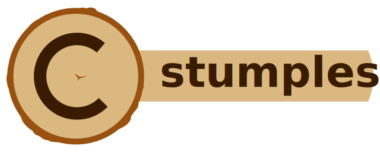

**다양한 기능을 갖춘 고성능 C 언어 로깅 라이브러리입니다.**

[](https://github.com/goatshriek/stumpless/actions/workflows/linux.yml)
[](https://github.com/goatshriek/stumpless/actions/workflows/windows.yml)
[](https://github.com/goatshriek/stumpless/actions/workflows/mac.yml)
[](https://codecov.io/gh/goatshriek/stumpless)
[](https://sonarcloud.io/dashboard?id=stumpless)
[](https://gitter.im/stumpless/community?utm_source=badge&utm_medium=badge&utm_campaign=pr-badge)
[](https://opensource.org/licenses/Apache-2.0)
[](https://github.com/goatshriek/stumpless/blob/latest/docs/CODE_OF_CONDUCT.md)  

  

[简体中文](./l10n/zh-cn/自述.md)
  

[English](./../../README.md)


[주요 기능](#주요-기능) |
[빌드 및 설치](#빠른-빌드-및-설치) |
[기본 사용법](#기본-사용법) |
[기여하기](#기여하기)  

  

## 주요 특징  
Stumpless에는 C 언어에 대한 로그를 빠르고 쉽게 만드는 많은 기능이 있습니다:
* Splunk, rsyslog, journald, Windows Event Log, sqlite 등과 같은
  [다양한 대상](#어디에-로그를-기록할-수-있나요?)에 로그를 기록할 수 있습니다!
* 사용자 요구에 맞는 구조화된 로그와 비구조화된 로그 지원
* Linux, Windows, Mac, FreeBSD, MinGW, MSYS2, Cygwin, DOS 등에서 빌드 가능!
* 스레드 안전성
* 런타임 비용이 발생하지 않도록, 컴파일 시 조정하거나 해당 기능을 제거할 수 있습니다.
* 다양한 언어로 번역되었습니다. 🇦🇱 🇧🇷 🇧🇬 🇨🇳 🇨🇿 🇩🇪 🇩🇰 🇪🇸 🇫🇷 🇬🇷 🇭🇺 🇮🇳 🇮🇱 🇮🇹
  🇯🇵 🇰🇪 🇰🇷 🇵🇱 🇸🇰 🇱🇰 🇸🇪 🇹🇷 🇺🇸
  ([여러분이 사용하는 언어로 번역해 주세요!](https://github.com/goatshriek/stumpless/blob/latest/docs/localization.md))
* 쉽게 사용 방법을 터득할 수 있습니다.
  [문서](https://goatshriek.github.io/stumpless/docs/c/latest/index.html),
  [예제](https://github.com/goatshriek/stumpless/tree/latest/docs/examples),
  및 [지원](https://gitter.im/stumpless/community).
  
### 어디에 로그를 기록할 수 있나요?
이 라이브러리의 주요 목표는 다양한 로그 대상에 대해 일관된 로그 인터페이스를 제공하는 것입니다. 이 라이브러리를 통해 사용자는 이벤트를 정의하고 해당 이벤트가 어디로 전송될지를 쉽게 결정할 수 있습니다. 이 라이브러리를 사용한다면, 다른 SDK를 찾거나 데몬 및 플러그인을 추가하여 원하는 곳으로 로그를 보내는 작업을 하지 않아도 됩니다. Stumpless는 다음에 대한 로그를 기록할 수 있습니다:
* 간단한 문자 버퍼
* 파일 및 스트림
* 유닉스 소켓(예: 로컬 syslog 데몬)
* 네트워크 서버(IPv4 또는 IPv6, TCP 또는 UDP)
* Systemd Journald 서비스
* Sqlite3 데이터베이스
* Windows Event Log
* 필요한 기타 모든 것에 대한 사용자 정의 함수!

필요한 것이 없나요? 요청 사항과 함께
[이슈](https://github.com/goatshriek/stumpless/issues/new?template=feature_request.md)를 만들어 주시면, 저희의
[로드맵](https://github.com/goatshriek/stumpless/blob/latest/docs/roadmap.md)에 포함하겠습니다!


## 빠른 빌드 및 설치  
Stumpless는 빌드를 위해 cmake와 cmake를 지원하는 빌드 도구 체인(GCC 또는 Visual Studio 등)만 필요합니다. 표준 GNU make 도구 체인을 사용하는 시스템에서는 다음 단계를 통해 쉽게 설치할 수 있습니다:


```sh
# 소스 트리의 최신 버전 클론
git clone git@github.com:goatshriek/stumpless.git

# 새로운 빌드 디렉토리 생성
mkdir build
cd build

# 새로운 빌드 구성
cmake ../stumpless
```

타겟을 열지 않으면, 이 메시지는 플랫폼의 기본 타겟에 기록됩니다:  
Linux에서는 `/dev/log`, Mac 시스템에서는 `/var/run/syslog`, Windows에서는 Windows Event Log에 기록됩니다. 타겟을 열거나 몇 개 열어둔 후에 `stumplog`를 호출하면, 가장 최근에 열린 타겟으로 로그가 전송됩니다.  
  
더 간단한 함수 호출을 원한다면, `stump` 함수를 사용하여 현재 타겟에 메시지를 보낼 수 있습니다. `printf`와 마찬가지로 형식 지정자도 사용할 수 있습니다:
  
```c
stump( "Login attempt failure #%d for user %s", count, username );
```

형식 지정자가 필요 없다면, `_str` 변형 중 하나를 사용하세요: 더 빠르고 안전합니다!  

```c
stump_str( "Login failure! See structured data for info." );
```
  
기본값 대신 특정 타겟을 열고 싶다면, 필요한 타겟을 열고 메시지를 보내 보세요.   
예를 들어, `example.log`라는 파일에 로그를 기록하려면:  
  
```c
target = stumpless_open_file_target( "example.log" );

// 마지막에 열린 타겟을 기본적으로 사용합니다
stump( "Login attempt failure #%d for user %s", count, username );
```

Splunk 또는 rsyslog와 같은 네트워크를 통해 메시지를 보내는 것도 간단하게 할 수 있습니다:  

```c
target = stumpless_open_udp4_target( "send-to-splunk-example",
                                     "mylogserver.com" ); // 또는 IP 주소를 사용하세요
stump( "Login attempt failure #%d for user %s", count, username );
```

여러 개의 타겟이 있는 경우, 선택한 타겟으로 메시지를 보내려면 다음과 같이 하면 됩니다:  

```c
stumpless_add_message( target,
                       "Login attempt failure #%d for user %s",
                       count,
                       username );
```


### 로그 레벨(Severity) 단축 명령어  
로그 호출에서 로그 레벨을 지정하는 것은 일반적인 방식입니다. Stumpless는 로그 레벨 지정을 더 간편하게 할 수 있도록 매크로 함수를 제공합니다. 예를 들어, INFO 레벨로 메시지를 기록하려면, 아래와 같이 간단하게 작성할 수 있습니다:    

```c
stump_i( "this gets logged as an info message" );
```

또한 각 메시지에 소스 파일, 줄 번호, 함수 이름 정보를 포함하고 싶다면 _t (여기서 't'는 추적을 의미합니다)를 사용할 수 있습니다:  

```c
stump_t( "this includes source info" );
```

이 함수를를 사용하면 `STUMPLESS_ENABLE_UPTO` 또는 `STUMPLESS_DISABLE_DOWNTO` 기호를 정의하여,  
로그 메시지를 생성하는 호출을 컴파일 시 쉽게 제거할 수 있다는 추가적인 이점이 있습니다.  
  
이를 통해 소스 코드의 차이 없이 프로덕션과 디버그 버전 간에 로그 레벨을 변경할 수 있습니다.  

```c
// stumpless.h를 포함(#include)하기 전에 반드시 이 변수를 정의해야 합니다
#define STUMPLESS_ENABLE_UPTO_INFO

// ...

// 이 로그는 정상적으로 통과합니다
stump_i( "I'm doing that thing you asked" );

// 이 디버깅 메시지는 완전히 제거됩니다: 런타임에 아무런 영향이 없습니다
stump_d( "DEBUG info: %d, %d, %s", thing_1, thing_2, stringy_thingy );
```

[stumpless/level](https://github.com/goatshriek/stumpless/tree/latest/include/stumpless/level)에서 로그 레벨 단축 명령어의 전체 목록을 확인하거나, [severity level example](https://github.com/goatshriek/stumpless/tree/latest/docs/examples/severity_level)에서 작동 중인 전체 프로그램을 확인해보세요.  


### 더 많은 예제
위의 시나리오, 특정 타겟 유형의 사용, 더 복잡한 메시지 구조를 처리하는 방법 등에 대한 자세한 예제를 보려면 [예제](./../../docs/examples)를 확인하세요. 이곳에는 컴파일하고 실행하며 수정할 수 있는 주석이 달린 예제 코드 파일이 포함되어 있습니다.

## 기여하기
문제를 발견했거나 기능 추가 요청을 하고 싶은가요? 템플릿 중 하나를 사용하여 이슈를 생성해 주시면 가능한 빨리 답변드리겠습니다. 프로젝트의 [기여 지침](./../../docs/CONTRIBUTING.md)에서 오픈 소스 커뮤니티에 기여할 수 있는 다양한 방법에 관한 자세한 내용을 확인할 수 있습니다!

코드를 작성하거나 직접 업데이트하고 싶으시다면, [개발 가이드](./../../docs/development.md)를 참고하세요. 기여 경험에 따른 선택지가 있습니다.

첫 번째 선택지는 [good first issue](https://github.com/goatshriek/stumpless/issues?q=is%3Aissue+is%3Aopen+label%3A%22good+first+issue%22)라는 레이블이 붙은 이슈 목록을 탐색하는 것입니다. 이 이슈들은 간단하지만 의미 있는 이슈입니다. 각 이슈는 해당 이슈를 해결하기 위한 일반적인 접근 방법을 제공합니다. 또한, 해당 이슈에 대한 세부 정보도 포함하고 있습니다. 이 프로젝트나 오픈 소스에 처음 기여를 시도해 보고 싶다면 좋은 출발점이 될 것입니다.

경험이 더 많은 개발자는 프로젝트의 전체 이슈 목록과 [로드맵](https://github.com/goatshriek/stumpless/blob/latest/docs/roadmap.md)을 살펴보는 것을 추천드립니다. 관심 있는 항목이 있다면 기존 이슈에 댓글을 남겨주세요. 해당 항목이 아직 존재하지 않는 경우 새 이슈를 열고 작업 의사를 밝혀 다른 사람들에게 진행 중임을 알려 주세요.   
  
## 문서화 및 커뮤니티
Stumpless에 대해 이 README.md에서 설명되지 않은 부분이 궁금하다면, 관련 문서를 확인해주세요. 문서는 [docs](https://github.com/goatshriek/stumpless/blob/latest/docs/) 폴더에 저장되어 있습니다. 저장소의 폴더에는 각 폴더가 포함하고 있는 내용과 관련 정보를 자세히 설명하는 README 파일이 포함되어 있습니다. 각 함수에 대한 문서도 [프로젝트 웹사이트](https://goatshriek.github.io/stumpless/)에서 호스팅되며, C 라이브러리와 C++와 같은 다른 언어 바인딩에 대한 문서도 포함되어 있습니다.

Stumpless는 로컬 설치에 대해서도 `man` 페이지 형태로 문서를 제공합니다. 라이브러리를 설치한 후, 헤더 파일의 이름을 언더스코어로 대체하여 man 명령어를 실행하면 해당 헤더 파일의 문서와 포함된 함수들을 확인할 수 있습니다. 예를 들어 `man stumpless_log.h`를 입력하면 간단한 문자열 메시지를 로그하는 함수에 대한 문서를 볼 수 있습니다.

프로젝트 팀 및 더 큰 커뮤니티에 도움을 요청할 수 있는 방법도 많이 있습니다.
 * [이슈](https://github.com/goatshriek/stumpless/issues) 및
   [토론](https://github.com/goatshriek/stumpless/discussions)에서 구체적인 질문이나 제안을 통해 도움을 요청할 수 있습니다.
 * [gitter](https://gitter.im/stumpless/community)에서 꾸준히 채팅이 이뤄지고 있어, 프로젝트 출시 내용을 확인하고 질문할 수 있습니다.
 * 프로젝트에 대한 뉴스는 일반적으로 [goatshriek](https://twitter.com/goatshriek)의 트위터를 통해 발표되며,
   [#StumplessLib](https://twitter.com/search?q=%23StumplessLib) 해시태그를 사용합니다.
 * 사적인 소통을 원하신다면 [이메일](mailto:joel@goatshriek.com)로 주요 유지 관리자에게 연락할 수 있습니다. 이는 프로젝트의 보안 문제를 [알리는](https://github.com/goatshriek/stumpless/blob/latest/docs/SECURITY.md#reporting-a-vulnerability) 방법으로, 가능한 빨리 문제를 해결하여 악용될 가능을 줄일 수 있습니다.

