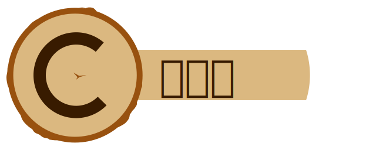

**高性能，很多特征的C日志库**

[English](./../../README.md)

[重要特征](#重要特征)

## 重要特征
无树桩有很多特征做C日志又快又容易：
 * 线程安全
 * 访问得容易的
   [文档](https://goatshriek.github.io/stumpless/docs/c/latest/index.html)，
   [示例](https://github.com/goatshriek/stumpless/tree/latest/docs/examples)，
   [支持](https://gitter.im/stumpless/community)。
